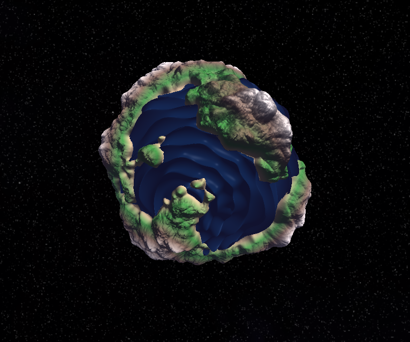
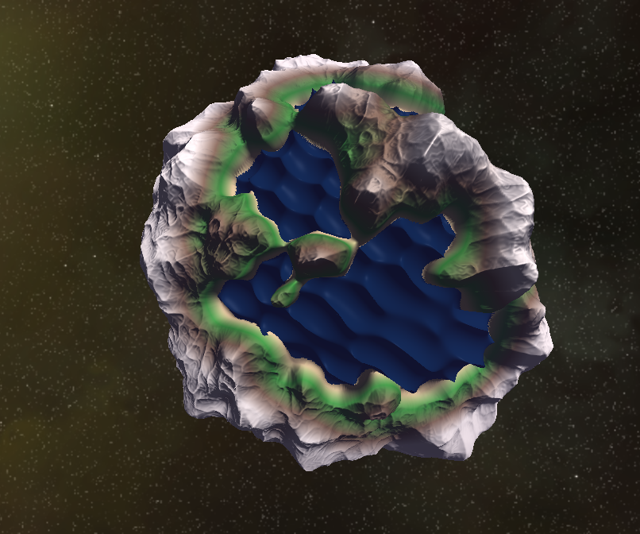
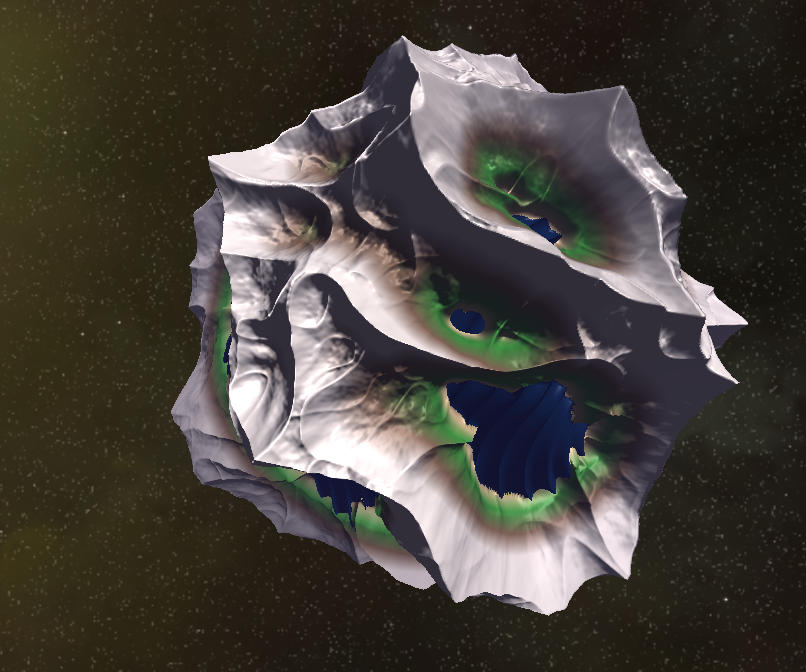
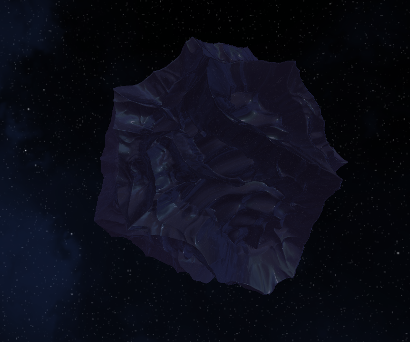

# Planetary Rain

A real-time procedural planet generator and editor built with **OpenGL 3.3** and **C++17**. Create unique planets with layered noise terrain, spherical Gerstner ocean waves, dynamic environment reflections, and physically-based materials — all adjustable in real time through an integrated ImGui editor.

<p align="center">
  
  
</p>

<p align="center">
  
  
</p>

---

## Features

### Procedural Terrain
Layered simplex noise evaluated entirely on the GPU. Three noise modes — normal, turbulent, and ridged — can be stacked with independent octaves, frequency, amplitude, persistence, and roughness controls. Terrain coloring is height-based with automatic land/ocean classification.

### Spherical Gerstner Waves
Ocean simulation directly on a sphere using the spherical Gerstner wave model from [Michelic 2018](https://cescg.org/wp-content/uploads/2018/04/Michelic-Real-Time-Rendering-of-Procedurally-Generated-Planets-2.pdf). Waves use analytical normals (no finite differences), geodesic distance for proper wavelength scaling, and smoothstep fading near wave origins and antipodes to prevent displacement loops. Up to 10 simultaneous wave layers with individually controllable frequency, speed, steepness, and origin direction.

### Cube-Sphere Geometry
Vertices are generated by subdividing a cube and projecting to a sphere using an [analytic mapping](https://mathproofs.blogspot.com/2005/07/mapping-cube-to-sphere.html) that produces near-uniform distribution. Detail level is adjustable from 1 to 500 subdivisions per face.

### Rendering
- Blinn-Phong shading with multiple point and directional lights
- Fresnel reflections (Schlick approximation) for water and metallic surfaces
- Separate refraction shader with index-of-refraction control and total internal reflection
- Per-object dynamic environment cubemaps rendered each frame
- Cubemap skybox with five randomized texture sets
- Exponential distance fog

### Live Editor
> An ImGui panel provides real-time control over geometry (radius, detail, position), material properties (diffuse, specular, shininess, reflectivity, IOR, transparency), noise layers, wave parameters, and rotation animation. A one-click randomizer generates planets across four archetypes: terrestrial, earth-like, desert, and ocean worlds.
---

## Getting Started

### Prerequisites

- **CMake** ≥ 3.16
- **C++17** compiler (GCC 9+, Clang 10+, or MSVC 2019+)
- **OpenGL 3.3+** capable GPU and drivers
- **Linux only:** system development packages

```bash
# Ubuntu / Debian
sudo apt install build-essential cmake freeglut3-dev libxi-dev libxrandr-dev

# Fedora
sudo dnf install gcc-c++ cmake freeglut-devel libXi-devel libXrandr-devel

# macOS — all dependencies are fetched automatically
# Windows — all dependencies are fetched automatically (use Visual Studio or MinGW)
```

### Build

```bash
cd src
mkdir build && cd build
cmake .. -DCMAKE_BUILD_TYPE=Release
cmake --build . --parallel
```

The first build takes a few minutes while CMake fetches and compiles all dependencies via `FetchContent`.

### Run

```bash
./PlanetaryRain
```

> Make sure the `textures/` and `shaders/` directories are accessible from the working directory. The build system copies them automatically into the build folder.

---

## Controls

| Key | Action |
|-----|--------|
| `Q` | Toggle between UI mode (mouse controls editor) and FPS mode (mouse controls camera) |
| `W` `A` `S` `D` | Move camera forward / left / backward / right |
| `Space` | Move camera up |
| `Scroll wheel` | Zoom (adjusts field of view) |
| `F` | Toggle wireframe rendering |
| `R` | Restart scene with a new random skybox |
| `ESC` | Quit |

---

## Dependencies

All fetched automatically — no manual installation required (except system GL/GLUT on Linux).

| Library | Version | Purpose |
|---------|---------|---------|
| [GLM](https://github.com/g-truc/glm) | 1.0.1 | Vector and matrix math |
| [GLEW](https://github.com/nigels-com/glew) | 2.2.0 | OpenGL extension loading |
| [FreeGLUT](https://github.com/FreeGLUTProject/freeglut) | 3.2.2 | Windowing, input, and context creation |
| [Assimp](https://github.com/assimp/assimp) | 5.3.1 | 3D model importing |
| [stb_image](https://github.com/nothings/stb) | latest | Image loading (textures, skybox faces) |
| [Dear ImGui](https://github.com/ocornut/imgui) | 1.90.1 | Immediate-mode GUI |

---

## Project Structure

```
src/
├── main.cpp                 # Entry point, GLUT initialization
├── game.cpp/h               # Top-level game state and restart logic
├── gamestate.h              # Input state, window dimensions, flags
├── scene.cpp/h              # Scene graph — objects, lights, env map passes
├── sphere.cpp/h             # Cube-sphere mesh generation, planet parameter updates
├── object.cpp/h             # Base renderable object (abstract)
├── draw.cpp/h               # Rendering pipeline — uniform setup, draw calls
├── camera.cpp/h             # FPS camera with pitch/yaw and projection
├── ui.cpp/h                 # ImGui editor, planet randomizer, wave randomizer
├── noise.cpp/h              # Noise layer settings (evaluated in vertex shader)
├── shaderProgram.cpp/h      # Shader compilation, linking, uniform locations
├── skybox.cpp/h             # Cubemap skybox loading and rendering
├── envMap.cpp/h             # Dynamic per-object environment cubemap
├── modelTexture.cpp/h       # Material properties and texture loading
├── meshGeometry.cpp/h       # VAO/VBO management, Assimp model loading
├── framework.cpp/h          # OpenGL initialization, shader/texture utilities
├── callbacks.cpp/h          # GLUT input callbacks
├── config.h                 # Compile-time constants
├── variables.cpp/h          # Global singletons (Game, UI)
├── utilities.cpp/h          # FPS counter
│
├── shaders/
│   ├── planet.vert          # Terrain displacement + spherical Gerstner waves
│   ├── planet.frag          # Terrain coloring, Blinn-Phong, water rendering
│   ├── refractive.frag      # Refraction with Fresnel and environment sampling
│   ├── skybox.vert/frag     # Cubemap skybox
│   ├── template.vert/frag   # Generic object shaders
│   └── shadow.vert/frag     # Shadow map (placeholder)
│
└── textures/
    └── skybox/
        ├── 0/ ... 4/        # Five skybox texture sets (right/left/top/bottom/front/back.png)
```

---

## How It Works

### Terrain Generation

The vertex shader displaces sphere vertices radially based on stacked noise layers. Each layer has independent parameters:

```
elevation = Σ noise_i(position × frequency_i) × amplitude_i
```

Noise is computed using 3D simplex noise with configurable octave count, persistence, and roughness. Vertices below the ocean level are clamped and rendered as water with a separate shading path.

### Ocean Waves

Water vertices are displaced using spherical Gerstner waves. Unlike planar Gerstner waves, these operate on the sphere surface using geodesic distance from configurable wave origins. The displacement follows equations 7–8 from [Michelic 2018](https://cescg.org/wp-content/uploads/2018/04/Michelic-Real-Time-Rendering-of-Procedurally-Generated-Planets-2.pdf), with analytical normals from equation 10 — avoiding expensive finite-difference normal computation. Steepness is faded near wave origins and antipodes (equation 11) to prevent degenerate geometry.

### Environment Mapping

Objects flagged for environment mapping get a dynamic cubemap rendered each frame from their center. The scene (excluding the object itself) is rendered into six framebuffer faces, producing real-time reflections of the skybox and other objects. The cubemap is sampled in the fragment shader alongside the static skybox cubemap, blended via Fresnel.

---

## License

This project is licensed under the [MIT License](LICENSE).

---

## Acknowledgments

- Spherical Gerstner wave model: [Michelic, *Real-Time Rendering of Procedurally Generated Planets*, CESCG 2018](https://cescg.org/wp-content/uploads/2018/04/Michelic-Real-Time-Rendering-of-Procedurally-Generated-Planets-2.pdf)
- Cube-to-sphere mapping: [Philip Nowell, *Mapping a Cube to a Sphere*](https://mathproofs.blogspot.com/2005/07/mapping-cube-to-sphere.html)
- Simplex noise GLSL implementation adapted from [Ashima Arts](https://github.com/ashima/webgl-noise)
- Gerstner wave references: [Catlike Coding — Waves](https://catlikecoding.com/unity/tutorials/flow/waves/), [GameIdea.org — Ocean Shader](https://gameidea.org/2023/12/01/3d-ocean-shader-using-gerstner-waves/)
